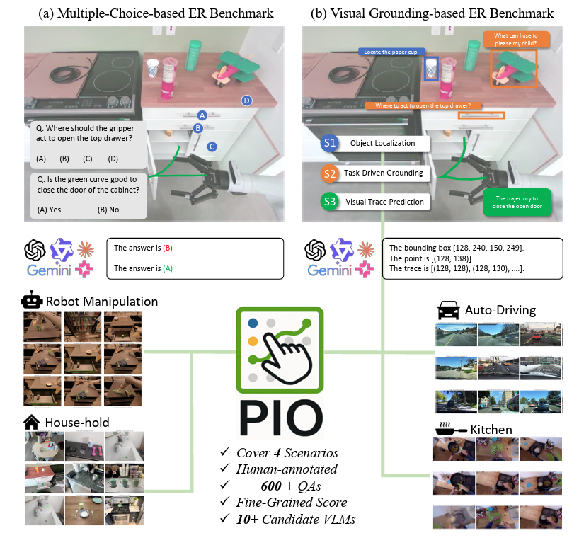
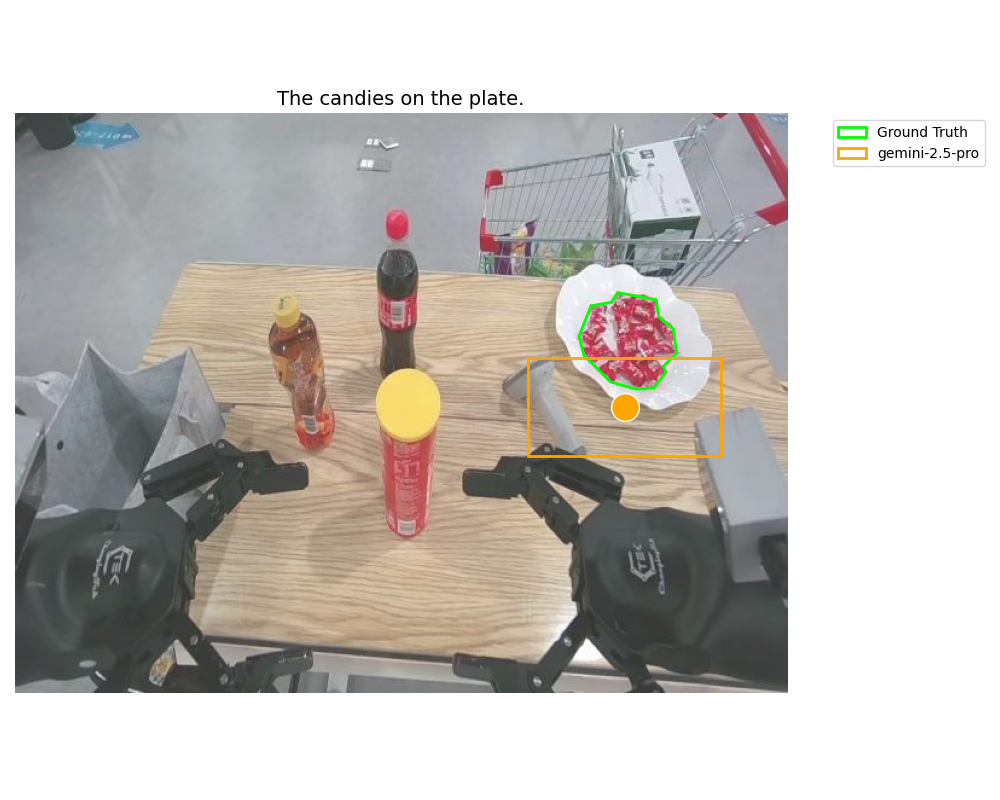
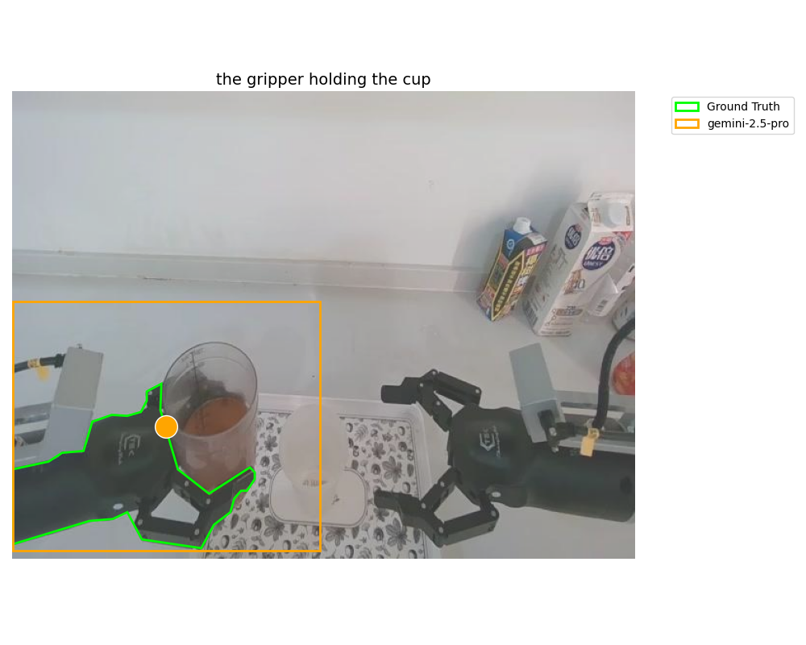
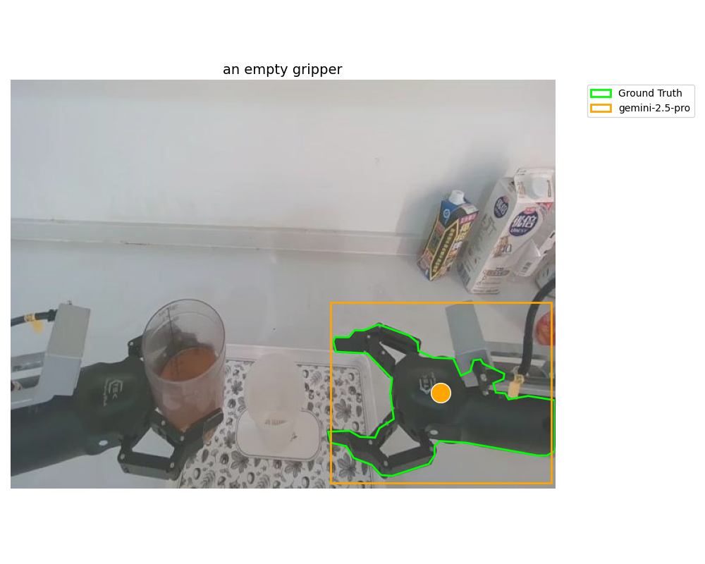
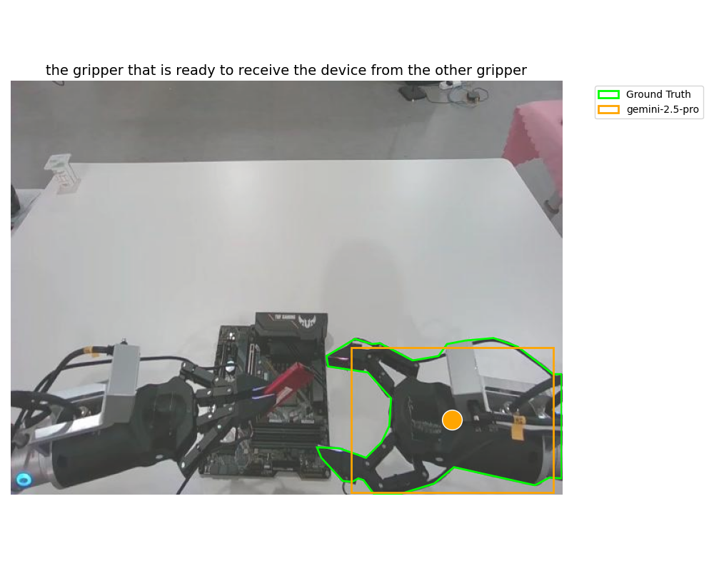
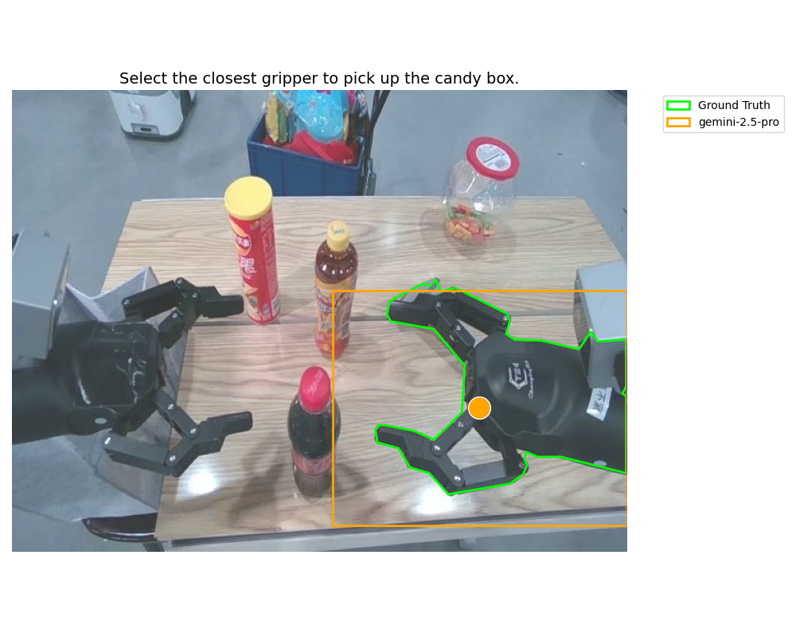
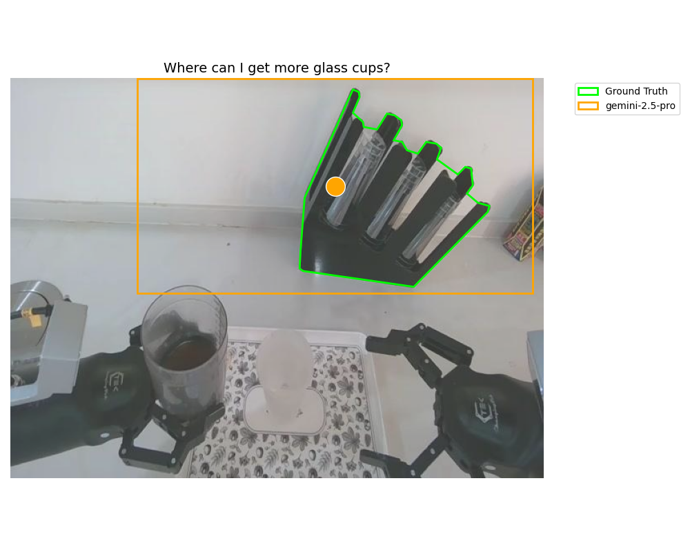
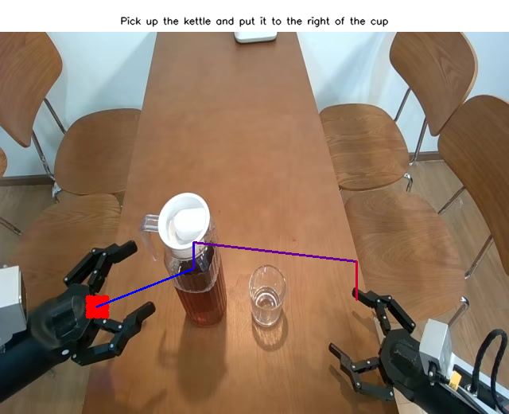
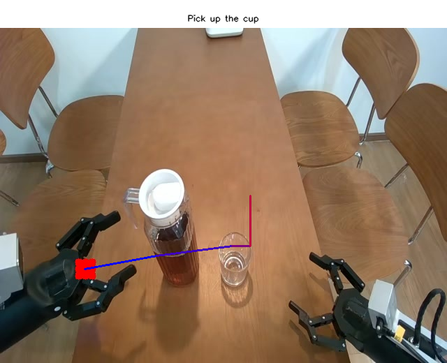

<h1 align="center">Point-It-Out (PIO)</h1>

<p align="center">
  <em>Benchmarking Embodied Reasoning for Vision Language Models in Multi-Stage Visual Grounding</em>
</p>

<p align="center">
  <a href="https://arxiv.org/abs/2509.25794">
    
  </a>
  &nbsp;
  <a href="https://xavihart.github.io/pio/index.html">
    
  </a>
  &nbsp;
  <a href="https://research.nvidia.com/labs/dir/pio/">
    
  </a>
</p>


<p align="center">
  
</p>

<p align="center">
  <strong>TL;DR:</strong> We move embodied reasoning evaluation from multiple-choice answers (A/B/C/D) to <strong>visual grounding</strong>, testing whether VLMs truly know <em>where to point</em> in realistic embodied scenarios.
</p>

<hr>


<p align="center">
  <strong>Haotian Xue</strong><sup>1,2*</sup>,
  <strong>Yunhao Ge</strong><sup>2</sup>,
  <strong>Yu Zeng</strong><sup>2</sup>,
  <strong>Zhaoshuo Li</strong><sup>2</sup>,
  <strong>Ming-Yu Liu</strong><sup>2</sup>,
  <strong>Yongxin Chen</strong><sup>1,2</sup>,
  <strong>Jiaojiao Fan</strong><sup>2</sup>
  <br>
  <sup>1</sup>Georgia Tech &nbsp; · &nbsp; <sup>2</sup>NVIDIA
</p>

<p align="center">
  <a href="https://arxiv.org/abs/2509.25794">
    <b>📄 Read the paper on arXiv</b>
  </a>
</p>

---

<div align="center">

<a href="#introduction">Introduction</a> •
<a href="#three-stage-design">Three-Stage Design</a> •
<a href="#pio-benchmarks">PIO Benchmarks</a> •
<a href="#demo-inference-on-gemini-25-pro">Demo Inference</a> •
<a href="#test-new-models">Test New Models</a> •
<a href="#evaluation">Evaluation</a>

</div>

---

## Introduction

Most embodied reasoning benchmarks evaluate models via **multiple-choice QA (MCQ)**: the model picks from options like A/B/C/D.  
However, real-world agents need to do more than choose an answer — they must **ground** their reasoning in the scene:

> *“Where exactly should I act?”*  
> *“Which object or location is the right one?”*

**Point-It-Out (PIO)** reframes embodied reasoning as **visual grounding** in realistic scenarios.  
Instead of asking “Which option is correct?”, PIO asks:

- <em>“Point to the correct object under certain constraints.”</em>  
- <em>“Point to the location that best satisfies a task goal.”</em>  
- <em>“Draw the trajectory that completes the task safely.”</em>  

We argue this is a crucial step toward connecting **multi-modal language models** to the **physical world**.

---

## Three-Stage Design

PIO consists of three stages, each targeting a different aspect of embodied reasoning:

- **(S1) Object Reference**  
  Refer to a specific object under different constraints:
  - Location (left/right/behind, etc.)
  - Object part (handle, lid, door, etc.)
  - Appearance attributes

- **(S2) Task-Centric Grounding**  
  Refer to **where to act** based on a downstream goal:
  - Recommendation (e.g., I am thirsty, point to something that can help)
  - Affordance (where to grasp / push / open)
  - Next-state prediction (where an object will move or should move)

- **(S3) Visual Trace Prediction**  
  Predict a **continuous trajectory** in the image to accomplish a task:
  - Draw a motion trace to open/close objects

---

## PIO Benchmarks

PIO currently contains **~600 human-curated questions**:

- **S1**: ~230 samples  
- **S2**: ~270 samples  
- **S3**: ~100 samples  

For **S1 / S2**:
- We provide **human-annotated ground truth** as segmentation masks.

For **S3**:
- We provide a **VLM-based judging prompt** to evaluate the quality of predicted visual traces (and recommend human evaluation for highest reliability).

### Loading S1 / S2 Data

```python
import json

s1s2_data = json.load(open('data/s1s2.json', 'rb'))
for sample in s1s2_data:
    polygon = sample['polygon']        # ground-truth seg mask (COCO-style polygon)
    image_path = sample['image_path']  # relative image path
    height, width = sample['height'], sample['width']
    prompt = sample['lang']            # task prompt
    s1_or_s2 = sample['s1_or_s2']      # 's1' or 's2'
    subclass = sample['subclasses']    # subclass label, e.g. "recommendation"
````

* The root of `image_path` is:

```text
data/images_s1s2/
```

### Loading S3 Data

```python
import json

s3_data = json.load(open('data/s3.json', 'rb'))
for sample in s3_data:
    image_path = sample['image_path']
    prompt = sample['lang']
```

* The root of `image_path` is:

```text
data/images_s3/
```

---

## Demo Inference on Gemini-2.5-pro

We provide **ready-to-run demo scripts** to perform inference on **all three stages (S1/S2/S3)** using `Gemini-2.5-flash` (or any other VLM defined in `code/vlms/`).

### S1 / S2 Demo

Simply run:

```bash
EXP_NAME="demo"
MAX_CASES=5  # set to -1 to run on all cases

python code/test_s1s2.py \
  --test_models gemini-2.5-flash \
  --max_cases ${MAX_CASES} \
  --exp_name ${EXP_NAME} \
  --which_s both \
  --save_path results \
  --s1s2_path data/s1s2.json
```

### S3 Demo

```bash
EXP_NAME="demo"
MAX_CASES=5  # set to -1 to run on all cases

python code/test_s3.py \
  --test_model gemini-2.5-flash \
  --max_cases ${MAX_CASES} \
  --exp_name ${EXP_NAME} \
  --json_path data/s3.json \
  --image_root data/images_s3 \
  --save_path results
```

After running these scripts, you will find:

* **Visualization**:
  `vis.png` (or similar) containing:

  * GT segmentation mask / polygon (S1/S2)
  * Model prediction (bbox / points / trajectory)
* **Raw predictions**:
  `info.npy` files containing model outputs and metadata.

Example visualizations (top row: S1, middle row: S2, bottom row: S3):

<p align="center">
  
  
  
</p>

<p align="center">
  
  
  
</p>

<p align="center">
  
  
  
</p>

---

## Test New Models

The **VLM zoo** is defined in:

```text
code/vlms/__init__.py
```

To plug in a new VLM:

1. **Register the model** in `get_vlm()`:

   * Add your `<model_name>` and corresponding `<ModelClass>`.

2. **Implement your model class** under `code/vlms/`:

   * Create `new_model.py` with a class implementing:

     * `__call__(...)` – used by default for **S1/S2**.
     * `preprocess_image(...)` – optional helper for image processing.
     * `s3(...)` – used for **S3 trajectory prediction**.

3. **Add prompts**:

   * Define your model’s prompt template and set the path via:

     ```python
     self.question_template = "prompts/your_model_prompt.txt"
     ```

We include demo implementations for:

* GPT series
* Gemini series
* MoLMO
* RoboRefer
* RoboBrain

along with their prompts in the `prompts/` directory.

---

## Evaluation

### S3 Evaluation

For **S3** (visual trace prediction), we provide an **automatic VLM-based evaluation prompt** in:

```text
prompts/s3_auto.txt
```

However, we **strongly recommend human evaluation** for rigorous assessment, especially for safety- and planning-critical tasks.

### S1 / S2 Evaluation

For **S1 / S2**, we provide an evaluation script:

```text
code/eval_s1s2.py
```

This script:

* Loads predictions from `results/` (output by `test_s1s2.py`)
* Computes IoU-based metrics against ground-truth segmentation
* Prints summary scores (S1, S2, and subclasses) to the console

You can use it to compare different models on the exact same benchmark.

---

Cite our paper if needed:

<p align="center">
    <em>If you find PIO useful, please consider starring the repo and citing the paper 💫</em>
</p>

```
@article{xue2025point,
  title={Point-It-Out: Benchmarking Embodied Reasoning for Vision Language Models in Multi-Stage Visual Grounding},
  author={Xue, Haotian and Ge, Yunhao and Zeng, Yu and Li, Zhaoshuo and Liu, Ming-Yu and Chen, Yongxin and Fan, Jiaojiao},
  journal={arXiv preprint arXiv:2509.25794},
  year={2025}
}
```
